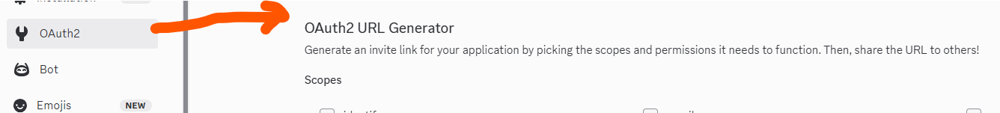
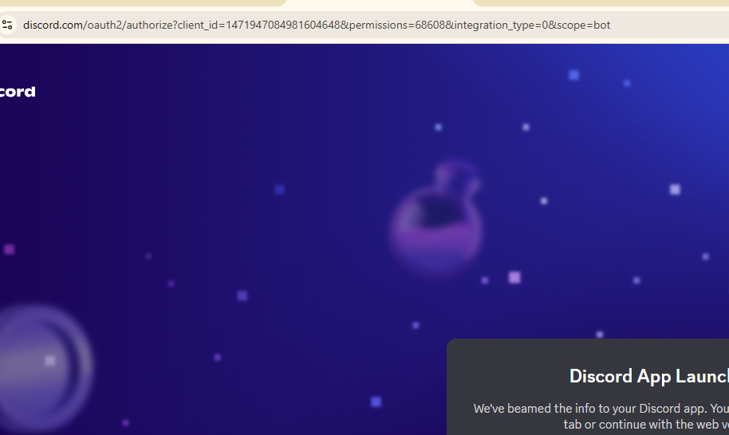
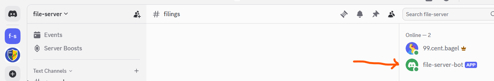

# READEME_discord.md

## Server + Channels (Discord App)

-   Enable Developer Mode (User Settings → Advanced)
-   Create server
-   Create text channels:
    -   #filings
    -   #filings2
-   Right click channel → Copy Channel ID

------------------------------------------------------------------------

## Bot Setup (Discord Developer Portal)

-   New Application → Name (e.g. SEC)
-   Bot → Add Bot
-   Copy BOT TOKEN
-   Enable: MESSAGE CONTENT INTENT
-   OAuth2 → URL Generator:
    -   Scope: ☑ bot
    -   Bot Permissions:
        -   View Channels
        -   Send Messages
        -   Read Message History
-   Copy generated Authorization URL

------------------------------------------------------------------------

## Add Bot to Server (Discord App)

-   Paste Authorization URL in browser
-   Select server
-   Authorize
-   Confirm bot appears in member list

------------------------------------------------------------------------

## Required Variables

-   DISCORD_BOT_TOKEN
-   DISCORD_FILINGS1_CHANNEL_ID
-   DISCORD_FILINGS2_CHANNEL_ID
